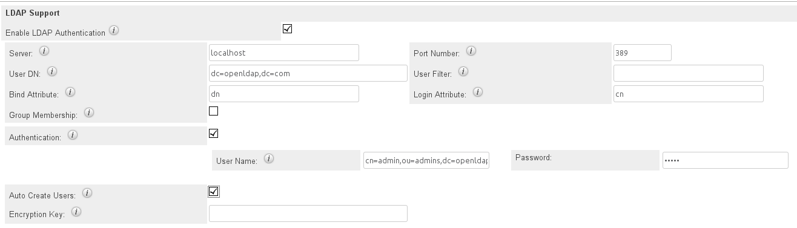

# Docker Compose OpenLDAP and phpLDAPAdmin.

* [OpenLDAP box](https://github.com/Appdynamics/extensions-docker).
* [phpLDAPAdmin box](https://github.com/osixia/docker-phpLDAPadmin).

## Getting Started
* Install [Docker](https://docs.docker.com/engine/installation/) and [Docker Compose](https://docs.docker.com/compose/install/).
* Go to `.../repository/openldap`
* Run `docker-compose up`. Use the `-d` to run containers in background - `docker-compose up -d`.
* To stop or remove containers made by `up` command run, in the `openldap` directory, `docker-compose stop` `docker-compose rm -f` commands respectively.

## Test Connection
* Docker:
  * `docker ps` - to show running containers.
  * `docker exec -t openldap ldapsearch -x -h localhost -b dc=openldap,dc=com -D "cn=admin,ou=admins,dc=openldap,dc=com" -w admin` - to search admin's data.
  The `openldap` name is defined in the compose file.
  * Make sure the result object does *not* look like `result: 32 No such object`.
  * Anonymous search is **enabled**, i.e. `docker exec -t openldap ldapsearch -x -h localhost -b dc=openldap,dc=com`
* PHP
  * `php test/connect-raw.php` - raw PHP.
  * `php test/connect-symfony.php` - Symfony. Run `php composer.phar install -d 'test'` first.
  * `php test/auth-symfony.php` - Authenticate the demo user via Symfony.

## phpLDAPAdmin
* Go to [http://localhost:8899](http://localhost:8899)
* Login(DN): `cn=admin,ou=admins,dc=openldap,dc=com`
* Password: `admin`

## Demo Data
* User fixtures `images/openldap/users.ldif`
* Users can be tested:
  * `docker exec -t openldap ldapsearch -x -h localhost -b dc=openldap,dc=com -D "cn=user1,ou=people,dc=openldap,dc=com" -w user1`
  * `docker exec -t openldap ldapsearch -x -h localhost -b ou=people,dc=openldap,dc=com -D "cn=user1,ou=people,dc=openldap,dc=com" -w user1`
  * `docker exec -t openldap ldapsearch -x -h localhost -b cn=user1,ou=people,dc=openldap,dc=com -D "cn=user1,ou=people,dc=openldap,dc=com" -w user1`

### Users' DN
* `cn=abey,ou=people,dc=openldap,dc=com`   - `abey`
* `cn=tandav,ou=people,dc=openldap,dc=com` - `tandav`
* `cn=user1,ou=people,dc=openldap,dc=com`  - `user1`
* `cn=user2,ou=people,dc=openldap,dc=com`  - `user2`
* `cn=user3,ou=people,dc=openldap,dc=com`  - `user3`

### Groups
* abey, tandav: `Administrators`
* user1, user2: `Read Only`
* user1: `Group1`
* user1, user2, user3: `Group2`

### Organisational Units
##### Admins
* Bind DN: `cn=admin,ou=admins,dc=openldap,dc=com`
* password: `admin`

##### People
* Base DN: `ou=people,dc=openldap,dc=com`
* Attributes: `dn, cn, uid, memberOf`

##### Groups
* Base DN: `ou=groups,dc=openldap,dc=com`
* Attributes: `dn, cn, member`

### SugarCRM LDAP

#TODO
